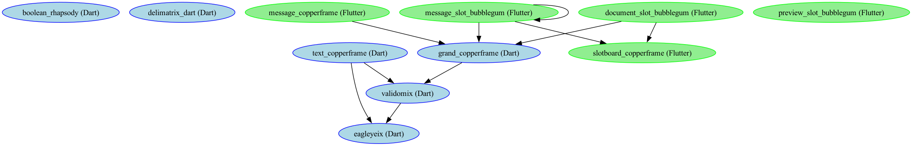

# Dart and Flutter dependencies

> Production Dart and Flutter dependencies ranking based on usage.

## Graph overview

## Dart production dependencies table

| Name      | Description | Score | Use | Min Version | Max Version | Latest Version | Updated     |
| --------- | ----------- | ----- | --- | ----------- | ----------- | -------------- | ----------- |
| eagleyeix | undefined   | ✰     | 2   |             |             | undefined      | > 2 years 🌩 |
| validomix | undefined   | ✰     | 2   |             |             | undefined      | > 2 years 🌩 |

## Flutter production dependencies table

| Name                   | Description                                                                                                                                                          | Score | Use | Min Version | Max Version | Latest Version | Updated     |
| ---------------------- | -------------------------------------------------------------------------------------------------------------------------------------------------------------------- | ----- | --- | ----------- | ----------- | -------------- | ----------- | 
| cupertino_icons        | Default icons asset for Cupertino widgets based on Apple styled icons                                                                                                | ✰     | 2   | ^1.0.8      | ^1.0.8      | 1.0.8          | < 2 year 🌧  |
| flutter                | Visit flutter.io to get started.                                                                                                                                     | ✰✰    | 6   |             |             | 0.0.20         | > 2 years 🌩 |
| flutter_localizations  | undefined                                                                                                                                                            |       | 1   |             |             | undefined      | > 2 years 🌩 |
| grand_copperframe      | undefined                                                                                                                                                            | ✰✰    | 4   |             |             | undefined      | > 2 years 🌩 |
| intl                   | Contains code to deal with internationalized/localized messages, date and number formatting and parsing, bi-directional text, and other internationalization issues. |       | 1   | any         | any         | 0.20.2         | < year ⛅   | }   |
| message_slot_bubblegum | undefined                                                                                                                                                            |       | 1   |             |             | undefined      | > 2 years 🌩 |
| slotboard_copperframe  | undefined                                                                                                                                                            | ✰     | 3   |             |             | undefined      | > 2 years 🌩 | 
