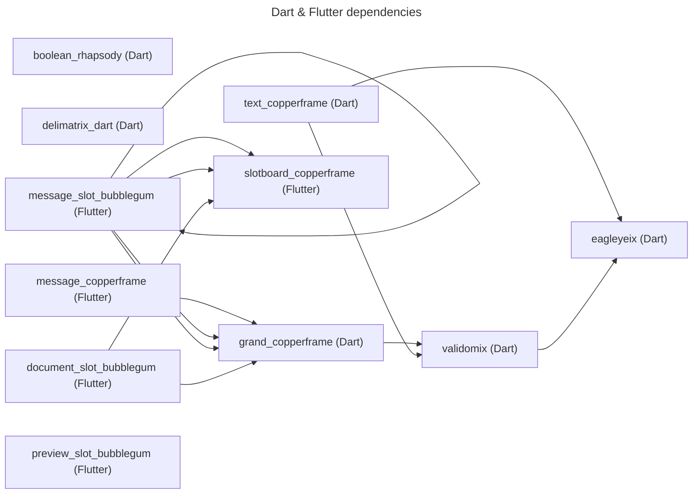

# Dart & Flutter Software dependencies

```mermaid
---
title: Dart & Flutter dependencies
---
flowchart LR
booleanrhapsody["boolean_rhapsody (Dart)"]
delimatrixdart["delimatrix_dart (Dart)"]
eagleyeix["eagleyeix (Dart)"]
grandcopperframe["grand_copperframe (Dart)"]
textcopperframe["text_copperframe (Dart)"]
validomix["validomix (Dart)"]
documentslotbubblegum["document_slot_bubblegum (Flutter)"]
messagecopperframe["message_copperframe (Flutter)"]
messageslotbubblegum["message_slot_bubblegum (Flutter)"]
previewslotbubblegum["preview_slot_bubblegum (Flutter)"]
slotboardcopperframe["slotboard_copperframe (Flutter)"]
textcopperframe --> eagleyeix
validomix --> eagleyeix
grandcopperframe --> validomix
textcopperframe --> validomix
messagecopperframe --> grandcopperframe
messageslotbubblegum --> grandcopperframe
messageslotbubblegum --> grandcopperframe
documentslotbubblegum --> grandcopperframe
messageslotbubblegum --> messageslotbubblegum
messageslotbubblegum --> slotboardcopperframe
messageslotbubblegum --> slotboardcopperframe
documentslotbubblegum --> slotboardcopperframe
```