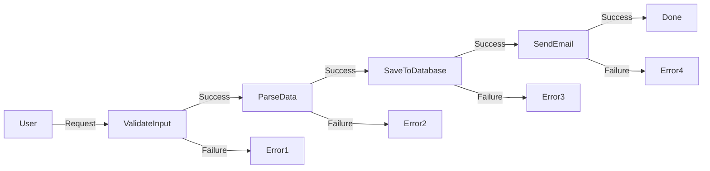
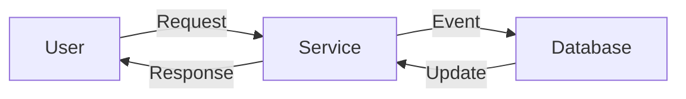

# Glossary

Glossary of the key terms for functional and object oriented programming.
Some additional references:

-   [Functional programming
    jargon](https://github.com/hemanth/functional-programming-jargon)

-   [FP glossary](https://degoes.net/articles/fp-glossary)

This glossary could also be used as a controlled vocabulary for
documentation.

# Higher-Order Function

A higher-order function (HOF) is a function that either:

-   Takes a function as an argument
-   Returns a function as a result

**Motivation:**

-   Reduce code duplication by abstracting common patterns
-   Encourage the single-responsibility principle by separating concerns
-   Enable functional composition by creating new functions from existing
    ones

**Example:**

In Haskell, a purely functional programming language, `map` is a higher-order
function that takes a function `f` and a list `xs` as arguments, and returns
a new list where each element is the result of applying `f` to the
corresponding element of `xs`.

```haskell
map :: (a -> b) -> [a] -> [b]
map f [] = []
map f (x:xs) = f x : map f xs
```

In Python, a multi-paradigm programming language that supports both
functional and object-oriented programming, `map` is also a higher-order
function that behaves similarly to Haskell's `map`, but returns an iterator
instead of a list.

```python
def map(f, xs):
    for x in xs:
        yield f(x)
```

## Currying and closure

These two related concepts in Typescript allow us to manipulate functions in
different ways:

-   **Closure** provides a way of binding a context to a function, so that
    the function can access variables that are defined outside its own
    scope. This is useful when we want to create functions that can
    remember some data or state.

-   **Currying** converts a function that takes multiple arguments into a
    sequence of functions that each take one argument. This is useful when
    we want to create functions that can be partially applied or customized
    with some fixed parameters.

-   Example: `const f = x => y => x + y;` is a curried function that takes
    two arguments `x` and `y`, but returns another function that takes `y`
    as its argument. We can use it like this: `f(2)(3)` or `const g = f(2);
    g(3);`

**Motivation:**

-   Currying makes it possible to have functions with a single parameter
    that can be used for `.map` or `.filter` while some specific context
    has been provided beforehand. For example, we can create a function
    that adds a fixed number to any given number: \`const add = x => y => x

<!---->

-   y; const add5 = add(5); const result = \[1, 2, 3].map(add5); // \[6, 7,
    8]\`

<!---->

-   Currying also makes it easier to use Point-Free Style, which is a way
    of writing code without explicitly mentioning the arguments. For
    example, instead of writing `const sum = (a, b) => a + b; const result = sum(2, 3);`, we can write `const sum = x => y => x + y; const result = sum(2)(3);`

More about [Currying and closure](https://en.wikipedia.org/wiki/Currying)

## Purity

A function is pure if the return value is only determined by its parameters
and it does not cause any side effects. Side effects are any changes to the
external world, such as modifying global variables, writing to a database,
logging to console, changing the DOM, etc.

**Motivation:**

-   Pure functions make it possible to predict the output based on the
    input, since they always return the same result for the same arguments.
    This makes them easier to test and debug.
-   Pure functions also make it easier to use functional programming
    techniques, such as currying, high-order functions, and object
    composition. These techniques can help us write more concise,
    expressive, and reusable code.
-   Pure functions also enable memoization, which is a way of caching the
    results of previous function calls to avoid unnecessary computations.

More about [Purity](https://en.wikipedia.org/wiki/Pure_function)

## Side effects

A function has side effects if it interacts with the external world, such as
modifying global variables, writing to a database, logging to console,
changing the DOM, etc. These interactions can affect the output of the
function or the state of the program in unpredictable ways.

**Motivation:**

-   Side effects are not desirable from a testing perspective because they
    make it harder to reproduce and verify the behavior of a function. They
    also introduce dependencies and coupling between different parts of the
    code.
-   Identifying side effects can help us isolate them in a limited number
    of functions and use pure functions for the rest of the logic. Pure
    functions are easier to test, debug, and reuse.
-   Avoiding side effects can also improve the performance and readability
    of our code by reducing unnecessary mutations and computations.

More about [Side
effects](https://en.wikipedia.org/wiki/Side_effect_\(computer_science\))

## Point-Free Style

Point-Free Style is a way of writing functions without explicitly mentioning
their arguments. Instead, functions are composed using other functions, such
as currying, partial application, or function composition.

**Motivation:**

-   Point-Free Style can avoid the creation of intermediate variables and
    make the code more concise and expressive.
-   Point-Free Style can also increase the readability and maintainability
    of the code by focusing on what the function does rather than how it
    does it.
-   Point-Free Style can also leverage the benefits of pure functions, such
    as predictability, testability, and reusability.

More about [Point-Free
Style](https://en.wikipedia.org/wiki/Tacit_programming)

## Railway oriented programming

Railway oriented programming is a functional approach for composing functions
that can return either a success or a failure¹². It uses the analogy of a
railway track with switches to represent the control flow of the program.



**Motivation:**

-   Railway oriented programming makes sure we think about and handle all
    possible outcomes of our functions, such as errors, exceptions, or
    invalid inputs.
-   Railway oriented programming allows us to compose functions in a linear
    way, where the success path is the main track and the failure path is a
    side track that can be switched to at any point.
-   Railway oriented programming avoids nested if-else statements or
    try-catch blocks and makes the code more readable and maintainable.

More about [Railway oriented
programming](https://swlaschin.gitbooks.io/fsharpforfunandprofit/content/posts/recipe-part2.html)

## Reactive programming

Reactive programming is a declarative programming paradigm concerned with
data streams and the propagation of change. It allows us to express how data
flows and reacts to events in a system.



**Motivation:**

-   Reactive programming can make the code cleaner and more concise by
    avoiding callbacks, promises, or state management.
-   Reactive programming can also make the code easier to scale by using
    asynchronous and non-blocking operations that can handle concurrency
    and backpressure.
-   Reactive programming can also improve the performance and user
    experience of the system by reducing latency and memory usage.

More about [Reactive
programming](https://en.wikipedia.org/wiki/Reactive_programming)

## Functional reactive programming

A programming paradigm that combines reactive programming (asynchronous
dataflow programming) with functional programming (using map, reduce, filter,
etc.). It aims to simplify problems that involve time-varying data, such as
graphical user interfaces, robotics, games, and music.

**Motivation:**

-   It has a well-defined semantic model that makes reasoning about the
    program easier
-   It allows declaring the dynamic behavior of a value at the time of its
    definition
-   It enables working with event streams instead of individual events,
    which can be more expressive and concise

**Examples:**

-   React is an OCaml module for functional reactive programming
-   Sodium is a library for functional reactive programming that supports
    multiple languages and UI frameworks
-   Dunai is a fast implementation in Haskell that supports both classic
    and arrowized FRP

To learn more about functional reactive programming, you can visit [this
Wikipedia
page](https://en.wikipedia.org/wiki/Functional_reactive_programming).
