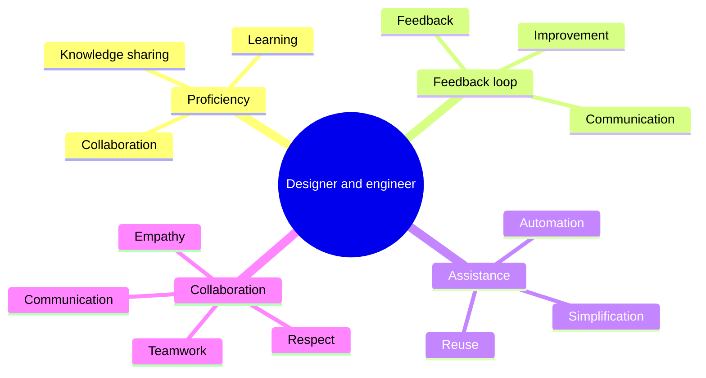
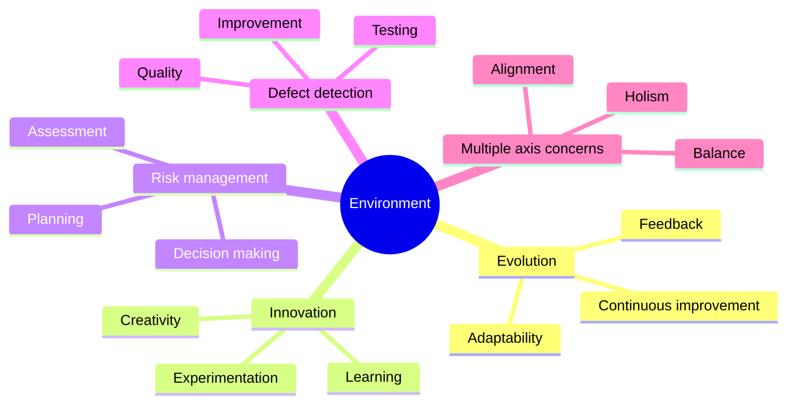

# Principles

The engineering principles we present here are not set in stone. They reflect
our current understanding and approach.
We should welcome and anticipate changes in the code base as we learn and
grow.
However, the core of our work should always be the designers and engineers,
who should work together and be supported in every way possible to eliminate
the barriers and foster innovation.

## Evolution

Software is always changing. It adapts to the needs of our users, our
business, and our technology. We welcome change and learn from it.

We value:

-   Continuous improvement: We strive to make our software better every
    day.
-   Feedback: We listen to what our users and stakeholders tell us about
    our software and act on it.
-   Adaptability: We are flexible and ready to adjust to new situations and
    requirements.

## Innovation :rocket:

We love to explore new possibilities. We try new things and see what works
and what doesn't. We deepen our understanding of problems and solutions. We
learn from our successes and failures.

We value:

-   Creativity: We use our imagination and skills to create original and
    useful software.
-   Experimentation: We test our ideas and hypotheses in a safe and
    controlled way.
-   Learning: We reflect on our experiences and apply our learnings to
    improve our software.

## Risk management

We balance risks and rewards. We consider the pros and cons of different
options and make informed decisions. We reduce risks and increase rewards.

We value:

-   Planning: We think ahead and prepare for different scenarios.
-   Assessment: We evaluate the potential impact of our actions and
    choices.
-   Decision-making: We use data and logic to make the best decisions for
    our software.

## Defect detection

We find and fix defects as soon as possible. We test our software thoroughly
and continuously. We prevent bugs from causing more problems.

We value:

-   Quality: We ensure that our software meets high standards of
    functionality, reliability, usability, and security.
-   Testing: We use various methods and tools to check the quality of our
    software at every stage of development.
-   Improvement: We fix defects quickly and prevent them from happening
    again.

## Multiple axis concerns

We consider multiple aspects of software development, such as software
engineering, user experience, business specification, documentation,
architecture, and implementation. We balance these aspects and align them
with our goals.

We value:

-   Holism: We look at the big picture and how all the parts fit together.
-   Balance: We weigh the importance of each aspect and prioritize
    accordingly.
-   Alignment: We ensure that all aspects of our software are consistent
    with our vision and objectives.

## Designer and engineer proficiency

We share our knowledge and skills with each other. We use tools that help us
design and engineer high-quality software. We keep learning and improving our
craft.

We value:

-   Collaboration: We work together and support each other in achieving our
    goals.
-   Knowledge sharing: We exchange information and insights with each other
    to increase our collective wisdom.
-   Learning: We seek new opportunities to learn new skills and
    technologies.

## Designer and engineer feedback loop

We get feedback to improve the design and engineering of our software. We
listen to our users, our stakeholders, and our peers. We measure the impact
of our changes.

We value:

-   Communication: We communicate clearly and effectively with each other
    and with external parties.
-   Feedback: We solicit, receive, and give constructive feedback to
    improve our software.
-   Improvement: We implement feedback and track the results of our
    changes.

## Designer and engineer assistance

We use tools that assist us in our creativity and effort. We automate
repetitive tasks and simplify complex ones. We leverage existing solutions
and avoid reinventing the wheel.

We value:

-   Automation: We use technology to perform tasks that can be done faster
    or better by machines.
-   Simplification: We make complex tasks easier by breaking them down into
    smaller steps or using simpler methods.
-   Reuse: We use existing solutions that have been proven to work well for
    similar problems.

## Collaboration

We work well with others. We are welcoming, inclusive, respectful, and
empathetic towards other team members. We communicate effectively and work
together towards a common vision.

We value:

-   Teamwork: We cooperate with each other and leverage each other's
    strengths.
-   Communication: We communicate clearly, respectfully, and frequently
    with each other.
-   Respect: We treat each other with dignity and appreciation.
-   Empathy: We understand each other's feelings, perspectives, and needs.
