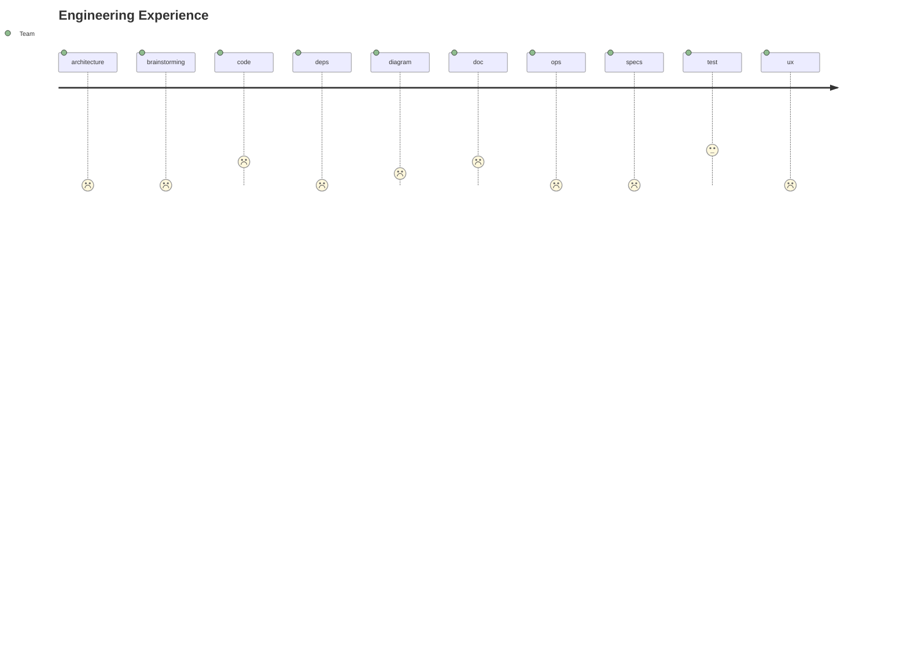

# Software health

The software health reflects our ability to deliver high-quality solutions that meet the needs of our diverse customers and stakeholders. 
It inspires us to:

- Adopt a consistent and inclusive approach that fosters collaboration and learning.
- Embrace creativity and innovation at scale to solve complex problems and create value.
- Automate repetitive tasks to free up time and resources for more impactful work.
- Evolve our code and features to adapt to changing requirements and expectations.

## Team journey overview

## Fine grain health table

| Document | Score | Rank  |
|----------| ------|-------|
| architecture clear-source-of-truth |  | 0 |
| architecture data-retention |  | 0 |
| architecture degrades-gracefully |  | 0 |
| architecture easy-to-understand |  | 0 |
| architecture loosely-coupled |  | 0 |
| architecture single-responsibility |  | 0 |
| architecture well-defined-interface |  | 0 |
| brainstorming drawing |  | 0 |
| brainstorming ideation |  | 0 |
| code generation | ✰ | 3 |
| code linting |  | 1 |
| code readibility |  | 0 |
| code refactoring |  | 0 |
| deps audit |  | 0 |
| deps diagram |  | 0 |
| deps update |  | 0 |
| diagram architecture |  | 0 |
| diagram class |  | 0 |
| diagram dependencies | ✰ | 2 |
| diagram flow |  | 0 |
| diagram mindmap |  | 0 |
| diagram sequence |  | 0 |
| diagram user-journey |  | 0 |
| doc accessibility-report |  | 0 |
| doc developer-guide | ✰✰ | 4 |
| doc formatting |  | 0 |
| doc grammar |  | 0 |
| doc privacy-report |  | 0 |
| doc proofreading |  | 0 |
| doc references-api | ✰ | 2 |
| doc references-glossary |  | 0 |
| doc references-schema |  | 0 |
| doc release-notes |  | 0 |
| doc security-report |  | 0 |
| doc spell-checking |  | 0 |
| doc support |  | 0 |
| doc troubleshooting |  | 0 |
| doc user-guide |  | 0 |
| ops alerting |  | 0 |
| ops backup |  | 0 |
| ops deployment |  | 0 |
| ops diagnosis |  | 0 |
| ops infrastructure-as-code |  | 0 |
| ops monitoring |  | 0 |
| ops rollback |  | 0 |
| specs business-cases |  | 0 |
| specs cost-benefit-analysis |  | 0 |
| specs interviews |  | 0 |
| specs risk-assessment |  | 0 |
| specs roadmap |  | 0 |
| specs surveys |  | 0 |
| specs user-stories |  | 0 |
| test accessibility |  | 0 |
| test browser |  | 0 |
| test device |  | 0 |
| test end-to-end |  | 0 |
| test functional |  | 0 |
| test integration |  | 0 |
| test platform |  | 0 |
| test regression | ✰✰ | 6 |
| test unit | ✰ | 3 |
| ux information-architecture |  | 0 |
| ux personas |  | 0 |
| ux prototyping |  | 0 |
| ux user-flows |  | 0 |
| ux user-research |  | 0 |
| ux wireframes |  | 0 |
