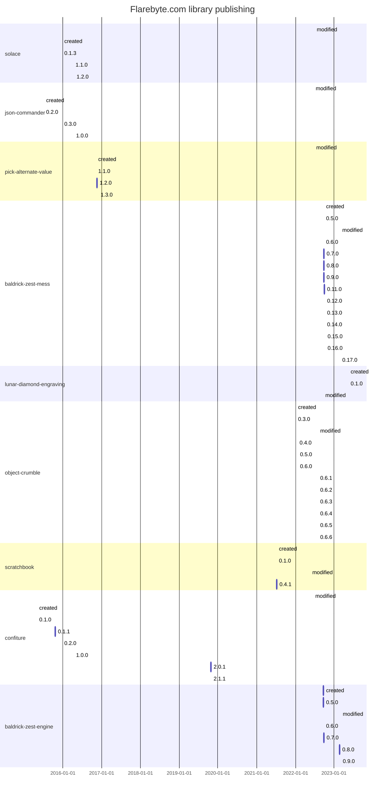

# Software publishing timeline

## Gantt of publishing libraries

```mermaid
gantt
    title Flarebyte.com library publishing
    dateFormat  YYYY-MM-DD

    section solace
   modified:, 2022-06-26, 1d
   created:, 2015-12-25, 1d
   0.1.3:, 2015-12-25, 1d
   1.1.0:, 2016-04-08, 1d
   1.2.0:, 2016-04-18, 1d


    section json-commander
   modified:, 2022-06-19, 1d
   created:, 2015-07-07, 1d
   0.2.0:, 2015-07-07, 1d
   0.3.0:, 2015-12-25, 1d
   1.0.0:, 2016-04-13, 1d


    section pick-alternate-value
   modified:, 2022-06-23, 1d
   created:, 2016-11-07, 1d
   1.1.0:, 2016-11-07, 1d
   1.2.0:, 2016-11-19, 1d
   1.3.0:, 2016-11-30, 1d


    section baldrick-zest-mess
   created:, 2022-09-25, 1d
   0.5.0:, 2022-09-25, 1d
   modified:, 2023-02-23, 1d
   0.6.0:, 2022-09-25, 1d
   0.7.0:, 2022-09-26, 1d
   0.8.0:, 2022-09-26, 1d
   0.9.0:, 2022-09-26, 1d
   0.11.0:, 2022-09-30, 1d
   0.12.0:, 2022-10-01, 1d
   0.13.0:, 2022-10-01, 1d
   0.14.0:, 2022-10-04, 1d
   0.15.0:, 2022-10-07, 1d
   0.16.0:, 2022-10-07, 1d
   0.17.0:, 2023-02-23, 1d


    section lunar-diamond-engraving
   created:, 2023-05-12, 1d
   0.1.0:, 2023-05-12, 1d
   modified:, 2023-05-12, 1d


    section object-crumble
   created:, 2022-01-01, 1d
   0.3.0:, 2022-01-01, 1d
   modified:, 2022-07-29, 1d
   0.4.0:, 2022-01-16, 1d
   0.5.0:, 2022-01-20, 1d
   0.6.0:, 2022-01-21, 1d
   0.6.1:, 2022-07-29, 1d
   0.6.2:, 2022-07-29, 1d
   0.6.3:, 2022-07-29, 1d
   0.6.4:, 2022-07-29, 1d
   0.6.5:, 2022-07-29, 1d
   0.6.6:, 2022-07-29, 1d


    section scratchbook
   created:, 2021-07-08, 1d
   0.1.0:, 2021-07-08, 1d
   modified:, 2022-05-17, 1d
   0.4.1:, 2021-07-09, 1d


    section confiture
   modified:, 2022-06-13, 1d
   created:, 2015-05-03, 1d
   0.1.0:, 2015-05-03, 1d
   0.1.1:, 2015-10-23, 1d
   0.2.0:, 2015-12-25, 1d
   1.0.0:, 2016-04-12, 1d
   2.0.1:, 2019-10-28, 1d
   2.1.1:, 2019-10-31, 1d


    section baldrick-zest-engine
   created:, 2022-09-21, 1d
   0.5.0:, 2022-09-21, 1d
   modified:, 2023-02-27, 1d
   0.6.0:, 2022-09-23, 1d
   0.7.0:, 2022-09-26, 1d
   0.8.0:, 2023-02-21, 1d
   0.9.0:, 2023-02-27, 1d

```

