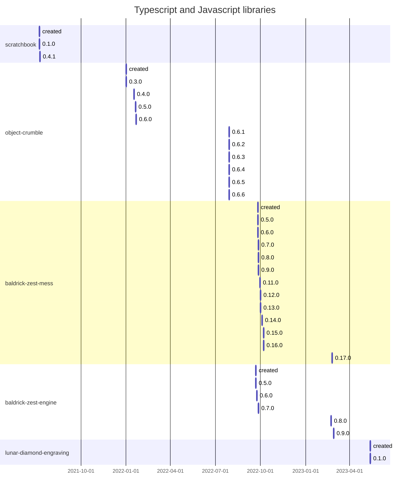
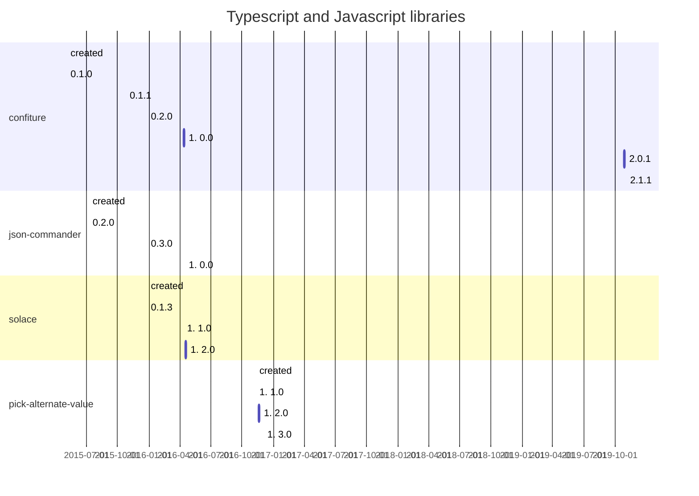
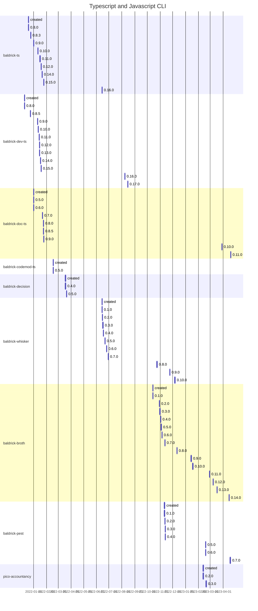
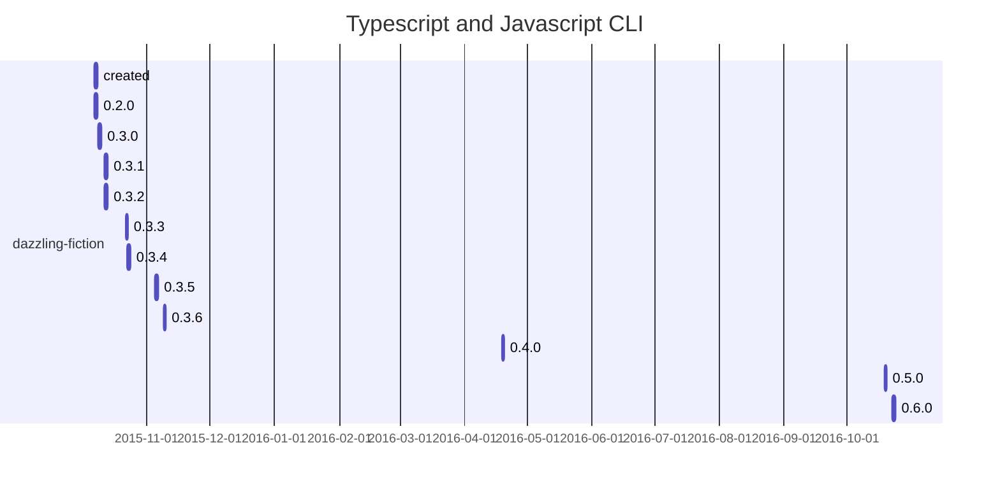

# Software publishing timeline

## Typescript and Javascript libraries

### Latest

```mermaid
gantt
    title Typescript and Javascript libraries
    dateFormat  YYYY-MM-DD

    section scratchbook
    created:, 2021-07-08, 1d
    0.1.0:, 2021-07-08, 1d
    0.4.1:, 2021-07-09, 1d


    section object-crumble
    created:, 2022-01-01, 1d
    0.3.0:, 2022-01-01, 1d
    0.4.0:, 2022-01-16, 1d
    0.5.0:, 2022-01-20, 1d
    0.6.0:, 2022-01-21, 1d
    0.6.1:, 2022-07-29, 1d
    0.6.2:, 2022-07-29, 1d
    0.6.3:, 2022-07-29, 1d
    0.6.4:, 2022-07-29, 1d
    0.6.5:, 2022-07-29, 1d
    0.6.6:, 2022-07-29, 1d


    section baldrick-zest-mess
    created:, 2022-09-25, 1d
    0.5.0:, 2022-09-25, 1d
    0.6.0:, 2022-09-25, 1d
    0.7.0:, 2022-09-26, 1d
    0.8.0:, 2022-09-26, 1d
    0.9.0:, 2022-09-26, 1d
    0.11.0:, 2022-09-30, 1d
    0.12.0:, 2022-10-01, 1d
    0.13.0:, 2022-10-01, 1d
    0.14.0:, 2022-10-04, 1d
    0.15.0:, 2022-10-07, 1d
    0.16.0:, 2022-10-07, 1d
    0.17.0:, 2023-02-23, 1d


    section baldrick-zest-engine
    created:, 2022-09-21, 1d
    0.5.0:, 2022-09-21, 1d
    0.6.0:, 2022-09-23, 1d
    0.7.0:, 2022-09-26, 1d
    0.8.0:, 2023-02-21, 1d
    0.9.0:, 2023-02-27, 1d


    section lunar-diamond-engraving
    created:, 2023-05-12, 1d
    0.1.0:, 2023-05-12, 1d

```

### Historical

```mermaid
gantt
    title Typescript and Javascript libraries
    dateFormat  YYYY-MM-DD

    section confiture
    created:, 2015-05-03, 1d
    0.1.0:, 2015-05-03, 1d
    0.1.1:, 2015-10-23, 1d
    0.2.0:, 2015-12-25, 1d
    1. 0.0:, 2016-04-12, 1d
    2.0.1:, 2019-10-28, 1d
    2.1.1:, 2019-10-31, 1d


    section json-commander
    created:, 2015-07-07, 1d
    0.2.0:, 2015-07-07, 1d
    0.3.0:, 2015-12-25, 1d
    1. 0.0:, 2016-04-13, 1d


    section solace
    created:, 2015-12-25, 1d
    0.1.3:, 2015-12-25, 1d
    1. 1.0:, 2016-04-08, 1d
    1. 2.0:, 2016-04-18, 1d


    section pick-alternate-value
    created:, 2016-11-07, 1d
    1. 1.0:, 2016-11-07, 1d
    1. 2.0:, 2016-11-19, 1d
    1. 3.0:, 2016-11-30, 1d

```

## Typescript and Javascript CLI

### Latest

```mermaid
gantt
    title Typescript and Javascript CLI
    dateFormat  YYYY-MM-DD

    section baldrick-ts
    created:, 2021-12-19, 1d
    0.8.0:, 2021-12-19, 1d
    0.8.3:, 2021-12-25, 1d
    0.9.0:, 2022-01-01, 1d
    0.10.0:, 2022-01-11, 1d
    0.11.0:, 2022-01-16, 1d
    0.12.0:, 2022-01-19, 1d
    0.14.0:, 2022-01-21, 1d
    0.15.0:, 2022-01-25, 1d
    0.16.0:, 2022-06-14, 1d


    section baldrick-dev-ts
    created:, 2021-12-10, 1d
    0.8.0:, 2021-12-10, 1d
    0.8.5:, 2021-12-24, 1d
    0.9.0:, 2022-01-10, 1d
    0.10.0:, 2022-01-12, 1d
    0.11.0:, 2022-01-14, 1d
    0.12.0:, 2022-01-15, 1d
    0.13.0:, 2022-01-15, 1d
    0.14.0:, 2022-01-17, 1d
    0.15.0:, 2022-01-19, 1d
    0.16.0:, 2022-08-08, 1d
    0.17.0:, 2022-08-15, 1d


    section baldrick-doc-ts
    created:, 2022-01-01, 1d
    0.5.0:, 2022-01-01, 1d
    0.6.0:, 2022-01-01, 1d
    0.7.0:, 2022-01-22, 1d
    0.8.0:, 2022-01-24, 1d
    0.8.5:, 2022-01-24, 1d
    0.9.0:, 2022-01-25, 1d
    0.10.0:, 2023-03-29, 1d
    0.11.0:, 2023-04-19, 1d


    section baldrick-codemod-ts
    created:, 2022-02-17, 1d
    0.5.0:, 2022-02-17, 1d


    section baldrick-decision
    created:, 2022-03-18, 1d
    0.4.0:, 2022-03-18, 1d
    0.5.0:, 2022-03-21, 1d


    section baldrick-whisker
    created:, 2022-06-14, 1d
    0.1.0:, 2022-06-14, 1d
    0.2.0:, 2022-06-15, 1d
    0.3.0:, 2022-06-16, 1d
    0.4.0:, 2022-06-17, 1d
    0.5.0:, 2022-06-21, 1d
    0.6.0:, 2022-06-25, 1d
    0.7.0:, 2022-06-29, 1d
    0.8.0:, 2022-10-24, 1d
    0.9.0:, 2022-11-24, 1d
    0.10.0:, 2022-12-06, 1d


    section baldrick-broth
    created:, 2022-10-14, 1d
    0.1.0:, 2022-10-14, 1d
    0.2.0:, 2022-10-30, 1d
    0.3.0:, 2022-10-31, 1d
    0.4.0:, 2022-11-02, 1d
    0.5.0:, 2022-11-03, 1d
    0.6.0:, 2022-11-05, 1d
    0.7.0:, 2022-11-12, 1d
    0.8.0:, 2022-12-11, 1d
    0.9.0:, 2023-01-14, 1d
    0.10.0:, 2023-01-18, 1d
    0.11.0:, 2023-02-27, 1d
    0.12.0:, 2023-03-08, 1d
    0.13.0:, 2023-03-17, 1d
    0.14.0:, 2023-04-15, 1d


    section baldrick-pest
    created:, 2022-11-11, 1d
    0.1.0:, 2022-11-11, 1d
    0.2.0:, 2022-11-12, 1d
    0.3.0:, 2022-11-13, 1d
    0.4.0:, 2022-11-13, 1d
    0.5.0:, 2023-02-18, 1d
    0.6.0:, 2023-02-18, 1d
    0.7.0:, 2023-04-18, 1d


    section pico-accountancy
    created:, 2023-02-12, 1d
    0.2.0:, 2023-02-12, 1d
    0.3.0:, 2023-02-19, 1d

```

### Historical

```mermaid
gantt
    title Typescript and Javascript CLI
    dateFormat  YYYY-MM-DD

    section dazzling-fiction
    created:, 2015-10-07, 1d
    0.2.0:, 2015-10-07, 1d
    0.3.0:, 2015-10-09, 1d
    0.3.1:, 2015-10-12, 1d
    0.3.2:, 2015-10-12, 1d
    0.3.3:, 2015-10-22, 1d
    0.3.4:, 2015-10-23, 1d
    0.3.5:, 2015-11-05, 1d
    0.3.6:, 2015-11-09, 1d
    0.4.0:, 2016-04-19, 1d
    0.5.0:, 2016-10-19, 1d
    0.6.0:, 2016-10-23, 1d

```
